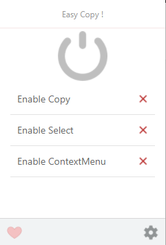
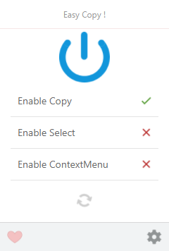
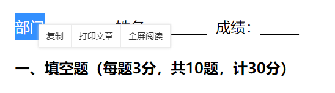

# Easy Copy

简单复制

## 安装

[Chrome 商店](https://chrome.google.com/webstore/detail/elcaegdandcagckkngpjelhgeakcmeif/reviews)

[Edge 商店](https://microsoftedge.microsoft.com/addons/detail/idaphphmgemeopcffdifdfniecjjllkl)

## 使用

当扩展激活时，扩展图标（地址栏右侧）高亮，否则置灰

> 新版 chrome 默认将扩展图标隐藏起来，需自己将其固定住才看得到

点击扩展图标（地址栏右侧），可以查看使用面板

点击最大的那个开关即可开启

正常选中文本，复制即可。注意，此处的**复制**，指的是浏览器原生的复制，可以是键盘的 `ctrl + c`，也可以是鼠标右键的原生复制

> 切记，不要使用网站提供的`复制`选项，比如下面这种就是错的
>
> 

请自行测试 [百度文库](https://wenku.baidu.com/view/d4d2e1e3122de2bd960590c69ec3d5bbfd0adaa6.html)、[360 文库](http://www.360doc.com/content/20/0624/00/67959838_920292162.shtml)

### 扩展

有些网站除了限制复制，还会限制**右键**和**选中**，使用面板上的`Enable Select`和`Enable ContextMenu`两个额外选项可分别解决
